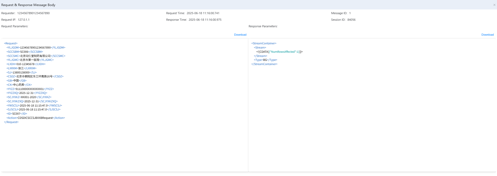

# 运行日志


记录系统运行过程中的各类事件和操作，帮助分析系统运行状况。

## 功能说明

### 日志查询筛选
- **Service Authorizer**: 服务授权者筛选，支持"All"选项查看所有授权者
- **Service Name**: 服务名称筛选，支持输入服务名称进行模糊查询
- **Subscription System**: 订阅系统筛选，支持"All"选项查看所有订阅系统
- **Third-party Status**: 第三方状态筛选，支持"All"选项查看所有状态
- **Time Period**: 时间段筛选，支持开始时间和结束时间范围选择
- **Session ID**: 会话ID筛选，支持输入会话ID进行精确查询
- **Search/Reset**: 提供搜索和重置功能按钮
- **Keyword Search**: 关键词搜索功能,(Outpatient Number, Inpatient Number, Patient ID, Doctor's Advice Number/Medical Order Number, Report Number, Medical Visit Serial Number/Treatment Serial Number, Medical Card Number/Patient Card Number)

### 日志操作按钮
- **Resend**: 重新发送日志记录
- **Resend All**: 批量重新发送所有日志记录

### 日志详细信息查看


点击"View Message"可查看详细的请求响应消息内容：

#### 请求响应消息体 (Request & Response Message Body)
**基本信息**：
- **Requester**: 请求者ID（如：123456789012345657890）
- **Request Time**: 请求时间（2025-06-18 11:16:00.741）
- **Request IP**: 请求IP地址（127.0.1.1）
- **Response Time**: 响应时间（2025-06-18 11:16:00.975）
- **Message ID**: 消息ID（1）
- **Session ID**: 会话ID（84056）

#### 请求参数 (Request Parameters)
显示完整的XML格式请求消息：
```xml
<Request>
<YLJGDM>123456789012345677890</YLJGDM>
<SCCSBM>SC006</SCCSBM>
<SCCSMC>北京同仁堂制药有限公司</SCCSMC>
<YLJGMC>北京同仁堂医院</YLJGMC>
<LXDH>010</LXDH>
<LXKXM>老三</LXKXM>
<SJ>13800138000</SJ>
<CS02>业务系统接收关系工作流说明</CS02>
<QB>中国</QB>
<QX>中心</QX>
<YT12>91110000XXXXXXX001</YT12>
<YZZDQ>2025-12-31</YZZDQ>
<SCWH>SCWH</SCWH>
<SDYWXCZQ>2025-12-31</SDYWXCZQ>
<WDX5J>2025-06-18 11:15:47.0</WDX5J>
<SJ5CSJ>2025-06-18 11:15:47.0</SJ5CSJ>
<ID>SC007</ID>
<Action>CDSDICSCCS|BXXBRequest</Action>
</Request>
```

#### 响应参数 (Response Parameters)
显示XML格式响应消息：
```xml
<StreamContainer>
<Stream>
<![CDATA[NumRowsAffected=1]]>
</Stream>
<Type>BG</Type>
</StreamContainer>
```

#### 功能按钮
- **Download**: 下载请求参数和响应参数内容

### 日志状态说明

#### 平台状态 (Platform Status)
- **成功**: 平台处理成功，显示为绿色标识
- **失败**: 平台处理失败（如有）

#### 第三方状态 (Third-party Status)
- **成功AAA**: 第三方系统处理成功
- **失败**: 第三方系统处理失败（如有）

### 日志管理操作
每条日志记录支持以下操作：
- **View Process**: 查看处理流程详情,HealthConnect EnsPortal.VisualTrace.zen?SESSIONID=84056
- **View Message**: 查看详细的请求响应消息内容

### 日志分析功能
- **性能分析**: 通过持续时间(ms)分析服务性能
- **成功率统计**: 通过平台状态和第三方状态统计成功率
- **会话追踪**: 通过Session ID追踪完整的业务会话
- **时间分析**: 分析调用开始时间和结束时间，识别业务高峰期

## 关键功能价值
- **完整日志记录**: 记录系统运行的完整链路信息
- **多维度查询**: 支持按服务、时间、状态等多种条件查询
- **实时监控**: 实时展示系统运行状态和第三方接口状态
- **性能分析**: 提供详细的响应时间和持续时间分析
- **问题定位**: 通过会话ID和详细消息内容快速定位问题
- **数据导出**: 支持日志数据的下载和导出
- **业务追溯**: 完整的请求响应链路，便于业务问题追溯

---

# Operation Log


Records various events and operations during system operation to help analyze system status.

## Feature Description

### Log Query and Filtering
- **Service Authorizer**: Service authorizer filtering with "All" option to view all authorizers
- **Service Name**: Service name filtering with fuzzy search by service name input
- **Subscription System**: Subscription system filtering with "All" option to view all subscription systems
- **Third-party Status**: Third-party status filtering with "All" option to view all statuses
- **Time Period**: Time period filtering with start time and end time range selection
- **Session ID**: Session ID filtering with exact session ID input
- **Search/Reset**: Provides search and reset function buttons
- **Keyword Search**: Keyword search functionality,(Outpatient Number, Inpatient Number, Patient ID, Doctor's Advice Number/Medical Order Number, Report Number, Medical Visit Serial Number/Treatment Serial Number, Medical Card Number/Patient Card Number,...)

### Log Operation Buttons
- **Resend**: Resend log record
- **Resend All**: Batch resend all log records


### Log Detail Information View


Clicking "View Message" allows viewing detailed request-response message content:

#### Request & Response Message Body
**Basic Information**:
- **Requester**: Requester ID (e.g., 123456789012345657890)
- **Request Time**: Request time (2025-06-18 11:16:00.741)
- **Request IP**: Request IP address (127.0.1.1)
- **Response Time**: Response time (2025-06-18 11:16:00.975)
- **Message ID**: Message ID (1)
- **Session ID**: Session ID (84056)

#### Request Parameters
Displays complete XML format request message:
```xml
<Request>
<YLJGDM>123456789012345677890</YLJGDM>
<SCCSBM>SC006</SCCSBM>
<SCCSMC>Beijing Tongrentang Pharmaceutical Co., Ltd.</SCCSMC>
<YLJGMC>Beijing Tongrentang Hospital</YLJGMC>
<LXDH>010</LXDH>
<LXKXM>Lao San</LXKXM>
<SJ>13800138000</SJ>
<CS02>Business system receives relationship workflow description</CS02>
<QB>China</QB>
<QX>Center</QX>
<YT12>91110000XXXXXXX001</YT12>
<YZZDQ>2025-12-31</YZZDQ>
<SCWH>SCWH</SCWH>
<SDYWXCZQ>2025-12-31</SDYWXCZQ>
<WDX5J>2025-06-18 11:15:47.0</WDX5J>
<SJ5CSJ>2025-06-18 11:15:47.0</SJ5CSJ>
<ID>SC007</ID>
<Action>CDSDICSCCS|BXXBRequest</Action>
</Request>
```

#### Response Parameters
Displays XML format response message:
```xml
<StreamContainer>
<Stream>
<![CDATA[NumRowsAffected=1]]>
</Stream>
<Type>BG</Type>
</StreamContainer>
```

#### Function Buttons
- **Download**: Download request parameters and response parameters content

### Log Status Description

#### Platform Status
- **Success**: Platform processing success, displayed with green indicator
- **Failure**: Platform processing failure (if any)

#### Third-party Status
- **Success AAA**: Third-party system processing success
- **Failure**: Third-party system processing failure (if any)

### Log Management Operations
Each log record supports the following operations:
- **View Process**: View process details, HealthConnect EnsPortal.VisualTrace.zen?SESSIONID=84056
- **View Message**: View detailed request-response message content

### Log Analysis Functions
- **Performance Analysis**: Analyze service performance through duration (ms)
- **Success Rate Statistics**: Calculate success rate through platform status and third-party status
- **Session Tracking**: Track complete business sessions through Session ID
- **Time Analysis**: Analyze invocation start and end times to identify business peak periods

## Key Functional Value
- **Complete Log Recording**: Records complete system operation chain information
- **Multi-dimensional Queries**: Supports queries by service, time, status, and other conditions
- **Real-time Monitoring**: Real-time display of system operation status and third-party interface status
- **Performance Analysis**: Provides detailed response time and duration analysis
- **Problem Location**: Quick problem location through session ID and detailed message content
- **Data Export**: Supports log data download and export
- **Business Traceability**: Complete request-response chain for business problem traceability 