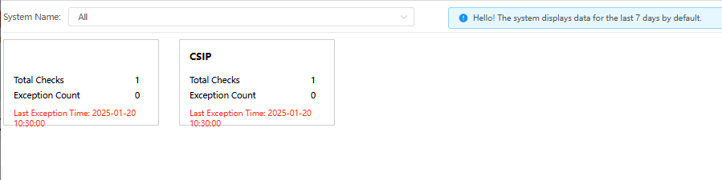

# 心跳监控

心跳监控用于检测服务或设备的在线状态，确保系统各部分正常通信。

## 功能说明

### 系统筛选功能
- **System Name**: 提供系统名称筛选功能，支持"All"选项查看所有系统
- **默认显示**: 系统默认显示最近7天的数据

### 系统心跳状态展示
页面以卡片形式展示各个系统的心跳检测状态：

#### 系统1 (未命名系统)
- **Total Checks**: 总检测次数 1
- **Exception Count**: 异常次数 0
- **Last Exception Time**: 最后异常时间 2025-01-20 10:30:00
- **状态**: 正常运行（异常次数为0表示系统稳定）

#### CSIP 系统
- **Total Checks**: 总检测次数 1
- **Exception Count**: 异常次数 0
- **Last Exception Time**: 最后异常时间 2025-01-20 10:30:00
- **状态**: 正常运行（异常次数为0表示系统稳定）

### 系统提示信息
- **信息提示**: "Hello! The system displays data for the last 7 days by default."
- **时间范围**: 默认显示最近7天的心跳检测数据
- **实时更新**: 系统实时更新各项心跳检测指标

## 关键指标说明
- **Total Checks**: 在指定时间段内系统心跳检测的总次数
- **Exception Count**: 心跳检测过程中发生异常的次数
- **Last Exception Time**: 最近一次异常发生的具体时间
- **系统状态判断**: 
  - Exception Count = 0：系统运行正常
  - Exception Count > 0：系统存在异常，需要关注
- **7天数据**: 提供一周内的历史数据趋势分析

## 监控价值
- **实时状态**: 快速了解各系统当前运行状态
- **异常预警**: 及时发现系统通信异常
- **历史追溯**: 通过最后异常时间追踪问题发生时点
- **稳定性评估**: 通过异常次数评估系统稳定性

---

# Heartbeat Monitoring

Heartbeat monitoring is used to detect the online status of services or devices, ensuring normal communication between system components.

## Feature Description

### System Filtering Function
- **System Name**: Provides system name filtering with "All" option to view all systems
- **Default Display**: System displays data for the last 7 days by default

### System Heartbeat Status Display
The page displays heartbeat detection status for each system in card format:

#### System 1 (Unnamed System)
- **Total Checks**: Total detection count 1
- **Exception Count**: Exception count 0
- **Last Exception Time**: Last exception time 2025-01-20 10:30:00
- **Status**: Running normally (exception count 0 indicates stable system)

#### CSIP System
- **Total Checks**: Total detection count 1
- **Exception Count**: Exception count 0
- **Last Exception Time**: Last exception time 2025-01-20 10:30:00
- **Status**: Running normally (exception count 0 indicates stable system)

### System Information
- **Information Tip**: "Hello! The system displays data for the last 7 days by default."
- **Time Range**: Displays heartbeat detection data for the last 7 days by default
- **Real-time Updates**: System updates all heartbeat detection metrics in real time

## Key Metrics Description
- **Total Checks**: Total number of system heartbeat detections within the specified time period
- **Exception Count**: Number of exceptions occurred during heartbeat detection
- **Last Exception Time**: Specific time when the most recent exception occurred
- **System Status Assessment**:
  - Exception Count = 0: System running normally
  - Exception Count > 0: System has exceptions, requires attention
- **7-Day Data**: Provides historical data trend analysis for one week

## Monitoring Value
- **Real-time Status**: Quickly understand current running status of each system
- **Exception Alert**: Timely detection of system communication anomalies
- **Historical Tracking**: Track problem occurrence time through last exception time
- **Stability Assessment**: Evaluate system stability through exception count 