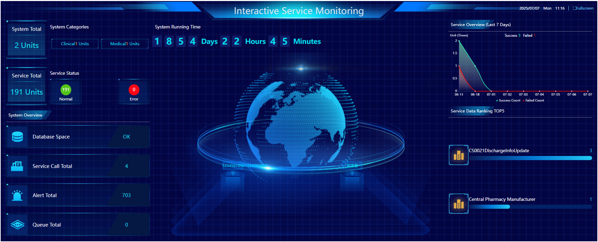

# 监控大屏

监控大屏用于集中展示系统各项运行指标和状态，便于运维人员实时掌握系统健康状况。

## 页面内容说明
- **系统总量/类别/运行时间**：展示当前接入的系统数量、类型及系统持续运行时间。
- **服务总量与状态**：统计所有服务数量，并以颜色区分正常与异常服务。
- **系统概况**：包括数据库空间、服务调用总数、告警总数、队列总数等核心指标。
- **服务概况（近七天）**：以折线图展示服务成功与失败次数的趋势。
- **服务数据排名TOP5**：列出调用次数最多的服务。
- **地球仪动画与发送者信息**：增强可视化效果，突出数据流转。

---

# Monitoring Dashboard

The monitoring dashboard provides a centralized display of various system operation metrics and statuses, enabling operations personnel to monitor system health in real time.

## Page Content Description
- **System Quantity/Type/Running Time**: Shows the number of connected systems, their types, and the total running time.
- **Service Quantity & Status**: Counts all services and distinguishes normal/abnormal services with color.
- **System Overview**: Includes key indicators such as database space, total service calls, total alerts, and total queues.
- **Service Overview (Last 7 Days)**: Line chart showing trends of successful and failed service calls.
- **Top 5 Service Data Rankings**: Lists the most frequently called services.
- **Globe Animation & Sender Info**: Enhances visualization and highlights data flow. 