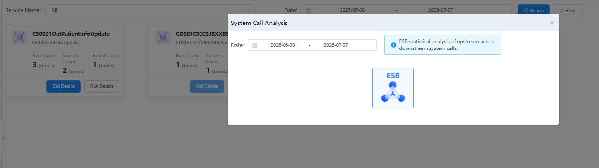

# 运行次数

统计和展示各类服务或任务的运行次数，便于分析业务负载和使用频率。

## 功能说明

### 服务筛选与查询
- **Service Name**: 提供服务名称筛选功能，支持"All"选项查看所有服务
- **Date**: 支持时间范围筛选，可设置开始日期和结束日期（如：2025-05-08 到 2025-07-07）
- **Search/Reset**: 提供搜索和重置功能按钮

### 服务运行统计展示
页面以卡片形式展示各个服务的运行统计信息：

#### CS0021OutPatientInfoUpdate (门诊患者信息更新服务)
- **Run Count**: 运行次数 3 (times)
- **Success Count**: 成功次数 2 (times)
- **Failed Count**: 失败次数 1 (times)
- **Call Details**: 查看详细调用信息
- **Run Details**: 查看运行详情

#### CDSDICSCCS|BXXBSrv (业务服务)
- **Run Count**: 运行次数 1 (times)
- **Success Count**: 成功次数 1 (times)
- **Failed Count**: 失败次数 0 (times)
- **Call Details**: 查看详细调用信息

### 系统调用分析弹窗
点击服务可弹出"System Call Analysis"分析窗口：
- **日期范围选择**: 2025-06-30 到 2025-07-07
- **ESB统计分析**: 显示上游和下游系统调用的统计分析
- **可视化图表**: 提供ESB调用关系的图形化展示

### 系统调用分析弹窗
点击服务可弹出"System Run Analysis"分析窗口：
## 关键指标说明
- **Run Count**: 服务在指定时间段内的总运行次数
- **Success Count**: 成功执行的次数，用于计算成功率
- **Failed Count**: 执行失败的次数，用于评估服务稳定性
- **成功率计算**: Success Count / Run Count × 100%

---

# Operation Count

Statistics and display of the number of runs for various services or tasks, facilitating analysis of business load and usage frequency.

## Feature Description

### Service Filtering and Query
- **Service Name**: Provides service name filtering with "All" option to view all services
- **Date**: Supports time range filtering with start and end date selection (e.g., 2025-05-08 to 2025-07-07)
- **Search/Reset**: Provides search and reset function buttons

### Service Operation Statistics Display
The page displays operation statistics for each service in card format:

#### CS0021OutPatientInfoUpdate (Outpatient Information Update Service)
- **Run Count**: Total runs 3 (times)
- **Success Count**: Successful runs 2 (times)
- **Failed Count**: Failed runs 1 (times)
- **Call Details**: View detailed call information
- **Run Details**: View operation details

#### CDSDICSCCS|BXXBSrv (Business Service)
- **Run Count**: Total runs 1 (times)
- **Success Count**: Successful runs 1 (times)
- **Failed Count**: Failed runs 0 (times)
- **Call Details**: View detailed call information

### System Call Analysis Modal
Clicking on a service opens the "System Call Analysis" window:
- **Date Range Selection**: 2025-06-30 to 2025-07-07
- **ESB Statistical Analysis**: Shows statistical analysis of upstream and downstream system calls
- **Visualization Chart**: Provides graphical display of ESB call relationships

## Key Metrics Description
- **Run Count**: Total number of service executions within the specified time period
- **Success Count**: Number of successful executions for calculating success rate
- **Failed Count**: Number of failed executions for evaluating service stability
- **Success Rate Calculation**: Success Count / Run Count × 100% 

### System Call Analysis Modal
Clicking on a service opens the "System Run Analysis" window:
## Key Metrics Description
- **Run Count**: Total number of service executions within the specified time period
- **Success Count**: Number of successful executions for calculating success rate  
- **Failed Count**: Number of failed executions for evaluating service stability
- **Success Rate Calculation**: Success Count / Run Count × 100%