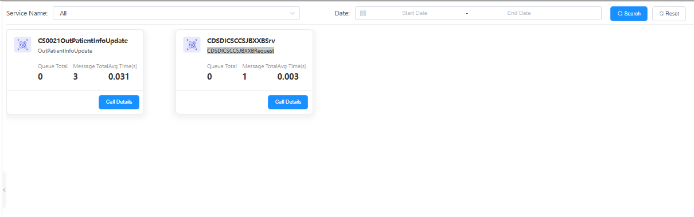

# 平台性能

平台性能模块用于展示系统的性能指标，如CPU、内存、响应时间等，帮助分析系统瓶颈。

## 功能说明

### 服务筛选与查询
- **Service Name**: 提供服务名称筛选功能，支持"All"选项查看所有服务
- **Date**: 支持时间范围筛选，可设置开始日期和结束日期
- **Search/Reset**: 提供搜索和重置功能按钮

### 服务性能展示
页面以卡片形式展示各个服务的性能指标：

#### CS0021OutPatientInfoUpdate (门诊患者信息更新服务)
- **Queue Total**: 队列总数 0
- **Message Total**: 消息总数 3  
- **Avg Time(s)**: 平均响应时间 0.031秒
- **Call Details**: 提供详细调用信息按钮

#### CDSDICSCCS|BXXBSrv (某业务服务)
- **Queue Total**: 队列总数 0
- **Message Total**: 消息总数 1
- **Avg Time(s)**: 平均响应时间 0.003秒  
- **Call Details**: 提供详细调用信息按钮

## 关键指标说明
- **Queue Total**: 当前排队等待处理的消息数量
- **Message Total**: 已处理的消息总数
- **Avg Time(s)**: 服务平均响应时间，用于评估服务性能
- **Call Details**: 点击可查看该服务的详细调用记录和性能分析

---

# Platform Performance

The platform performance module displays system performance metrics such as CPU, memory, and response time, helping to analyze system bottlenecks.

## Feature Description

### Service Filtering and Query
- **Service Name**: Provides service name filtering with "All" option to view all services
- **Date**: Supports time range filtering with start and end date selection
- **Search/Reset**: Provides search and reset function buttons

### Service Performance Display
The page displays performance metrics for each service in card format:

#### CS0021OutPatientInfoUpdate (Outpatient Information Update Service)
- **Queue Total**: Total queue count 0
- **Message Total**: Total message count 3
- **Avg Time(s)**: Average response time 0.031 seconds
- **Call Details**: Provides detailed call information button

#### CDSDICSCCS|BXXBSrv (Business Service)
- **Queue Total**: Total queue count 0
- **Message Total**: Total message count 1
- **Avg Time(s)**: Average response time 0.003 seconds
- **Call Details**: Provides detailed call information button

## Key Metrics Description
- **Queue Total**: Number of messages currently queued for processing
- **Message Total**: Total number of messages processed
- **Avg Time(s)**: Average service response time for performance evaluation
- **Call Details**: Click to view detailed call records and performance analysis for the service 