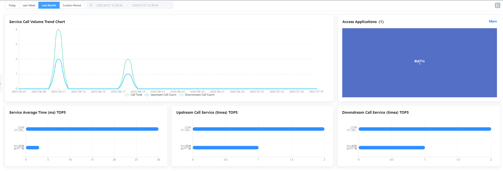

# 服务总览

服务总览模块汇总展示所有服务的基本信息和运行状态，便于统一管理。

## 功能说明

### 时间范围选择
- **Today**: 查看今日数据
- **Last Week**: 查看上周数据  
- **Last Month**: 查看上月数据
- **Custom Period**: 自定义时间范围（2025-06-07 12:46:46 到 2025-07-07 12:46:46）

### 服务调用量趋势图表
**Service Call Volume Trend Chart** 显示服务调用量的时间趋势：
- **时间轴**: 从2025-06-07到2025-07-07的时间范围
- **调用量曲线**: 
  - 蓝色曲线表示Call Total（总调用量）
  - 绿色曲线表示Upstream Call Count（上游调用数）
  - 橙色曲线表示Downstream Call Count（下游调用数）
- **峰值分析**: 图表显示两个明显的调用峰值，便于分析业务高峰期

### 服务性能TOP排行榜
页面下方展示三个关键性能指标的TOP排行：

#### Service Average Time (ms) TOP5
服务平均响应时间排行：
- **CS002|OutPatientInfoUpdate**: 约30ms
- **其他服务**: 约5ms

#### Upstream Call Service (times) TOP5  
上游调用服务次数排行：
- **CS002|OutPatientInfoUpdate**: 约2次
- **其他服务**: 约1次

#### Downstream Call Service (times) TOP5
下游调用服务次数排行：
- **CS002|OutPatientInfoUpdate**: 约1.5次
- **其他服务**: 约1次

### 接入应用展示
**Access Applications (1)** 区域：
- 显示当前接入的应用数量
- **More**: 提供查看更多应用的链接
- 以卡片形式展示应用信息

## 关键指标说明
- **Call Total**: 服务总调用次数
- **Upstream Call Count**: 上游系统调用该服务的次数
- **Downstream Call Count**: 该服务调用下游系统的次数
- **Average Time (ms)**: 服务平均响应时间，单位毫秒
- **TOP排行**: 帮助识别高频调用和高响应时间的服务

---

# Service Overview

The service overview module summarizes and displays the basic information and running status of all services for unified management.

## Feature Description

### Time Range Selection
- **Today**: View today's data
- **Last Week**: View last week's data
- **Last Month**: View last month's data
- **Custom Period**: Custom time range (2025-06-07 12:46:46 to 2025-07-07 12:46:46)

### Service Call Volume Trend Chart
**Service Call Volume Trend Chart** shows the time trend of service call volume:
- **Time Axis**: Time range from 2025-06-07 to 2025-07-07
- **Call Volume Curves**:
  - Blue curve represents Call Total
  - Green curve represents Upstream Call Count
  - Orange curve represents Downstream Call Count
- **Peak Analysis**: Chart shows two distinct call peaks for business peak period analysis

### Service Performance TOP Rankings
The lower section displays TOP rankings for three key performance metrics:

#### Service Average Time (ms) TOP5
Service average response time rankings:
- **CS002|OutPatientInfoUpdate**: Approximately 30ms
- **Other Services**: Approximately 5ms

#### Upstream Call Service (times) TOP5
Upstream call service frequency rankings:
- **CS002|OutPatientInfoUpdate**: Approximately 2 times
- **Other Services**: Approximately 1 time

#### Downstream Call Service (times) TOP5
Downstream call service frequency rankings:
- **CS002|OutPatientInfoUpdate**: Approximately 1.5 times
- **Other Services**: Approximately 1 time

### Access Applications Display
**Access Applications (1)** section:
- Shows the number of currently connected applications
- **More**: Provides link to view more applications
- Displays application information in card format

## Key Metrics Description
- **Call Total**: Total number of service calls
- **Upstream Call Count**: Number of times upstream systems call this service
- **Downstream Call Count**: Number of times this service calls downstream systems
- **Average Time (ms)**: Service average response time in milliseconds
- **TOP Rankings**: Help identify high-frequency calls and high response time services 