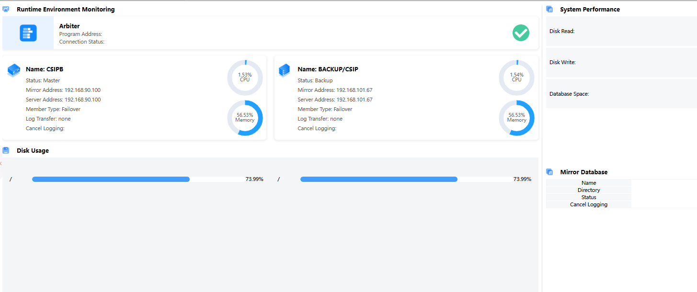

# 系统监控

系统监控模块用于实时监控系统的各项核心资源和服务状态，及时发现异常。

## 功能说明

### 运行环境监控 (Runtime Environment Monitoring)
**Arbiter 仲裁器监控**:
- **Program Address**: 程序地址
- **Connection Status**: 连接状态 (绿色勾号表示正常)

**系统实例监控**:
#### CSIPB 实例
- **Name**: CSIPB
- **Status**: Master (主节点)
- **Mirror Address**: 192.168.90.100
- **Server Address**: 192.168.90.100
- **Member Type**: Failover (故障转移)
- **Log Transfer**: none
- **Cancel Logging**: (取消日志记录选项)
- **CPU使用率**: 1.53%
- **内存使用率**: 56.53%

#### BACKUP/CSIP 实例
- **Name**: BACKUP/CSIP
- **Status**: Backup (备份节点)
- **Mirror Address**: 192.168.101.67
- **Server Address**: 192.168.101.67
- **Member Type**: Failover (故障转移)
- **Log Transfer**: none
- **Cancel Logging**: (取消日志记录选项)
- **CPU使用率**: 1.54%
- **内存使用率**: 56.53%

### 磁盘使用监控 (Disk Usage)
显示两个实例的磁盘使用情况:
- **磁盘使用率**: 73.99% (两个实例均显示相同使用率)
- **可视化进度条**: 蓝色进度条直观显示磁盘使用状态

### 系统性能面板 (System Performance)
**磁盘性能指标**:
- **Disk Read**: 磁盘读取性能
- **Disk Write**: 磁盘写入性能
- **Database Space**: 数据库空间使用情况

**镜像数据库 (Mirror Database)**:
- **Name**: 数据库名称
- **Directory**: 目录信息
- **Status**: 运行状态
- **Cancel Logging**: 日志记录控制

## 关键指标说明
- **CPU使用率**: 实时显示系统CPU占用百分比
- **内存使用率**: 显示内存占用情况，帮助识别内存瓶颈
- **磁盘使用率**: 监控存储空间使用情况，预防空间不足
- **连接状态**: 绿色表示正常，红色表示异常
- **Master/Backup**: 主备模式确保系统高可用性

---

# System Monitoring

The system monitoring module is used to monitor key system resources and service statuses in real time, enabling timely detection of anomalies.

## Feature Description

### Runtime Environment Monitoring
**Arbiter Monitoring**:
- **Program Address**: Program address information
- **Connection Status**: Connection status (green checkmark indicates normal)

**System Instance Monitoring**:
#### CSIPB Instance
- **Name**: CSIPB
- **Status**: Master (primary node)
- **Mirror Address**: 192.168.90.100
- **Server Address**: 192.168.90.100
- **Member Type**: Failover
- **Log Transfer**: none
- **Cancel Logging**: (cancel logging option)
- **CPU Usage**: 1.53%
- **Memory Usage**: 56.53%

#### BACKUP/CSIP Instance
- **Name**: BACKUP/CSIP
- **Status**: Backup (backup node)
- **Mirror Address**: 192.168.101.67
- **Server Address**: 192.168.101.67
- **Member Type**: Failover
- **Log Transfer**: none
- **Cancel Logging**: (cancel logging option)
- **CPU Usage**: 1.54%
- **Memory Usage**: 56.53%

### Disk Usage Monitoring
Shows disk usage for both instances:
- **Disk Usage**: 73.99% (both instances show the same usage rate)
- **Visual Progress Bar**: Blue progress bar provides intuitive disk usage status

### System Performance Panel
**Disk Performance Metrics**:
- **Disk Read**: Disk read performance
- **Disk Write**: Disk write performance
- **Database Space**: Database space usage

**Mirror Database**:
- **Name**: Database name
- **Directory**: Directory information
- **Status**: Running status
- **Cancel Logging**: Logging control

## Key Metrics Description
- **CPU Usage**: Real-time display of system CPU utilization percentage
- **Memory Usage**: Shows memory utilization to help identify memory bottlenecks
- **Disk Usage**: Monitors storage space usage to prevent space shortage
- **Connection Status**: Green indicates normal, red indicates abnormal
- **Master/Backup**: Master-backup mode ensures high system availability 