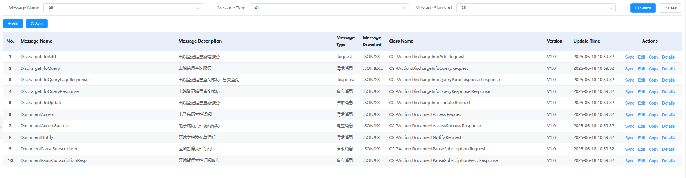
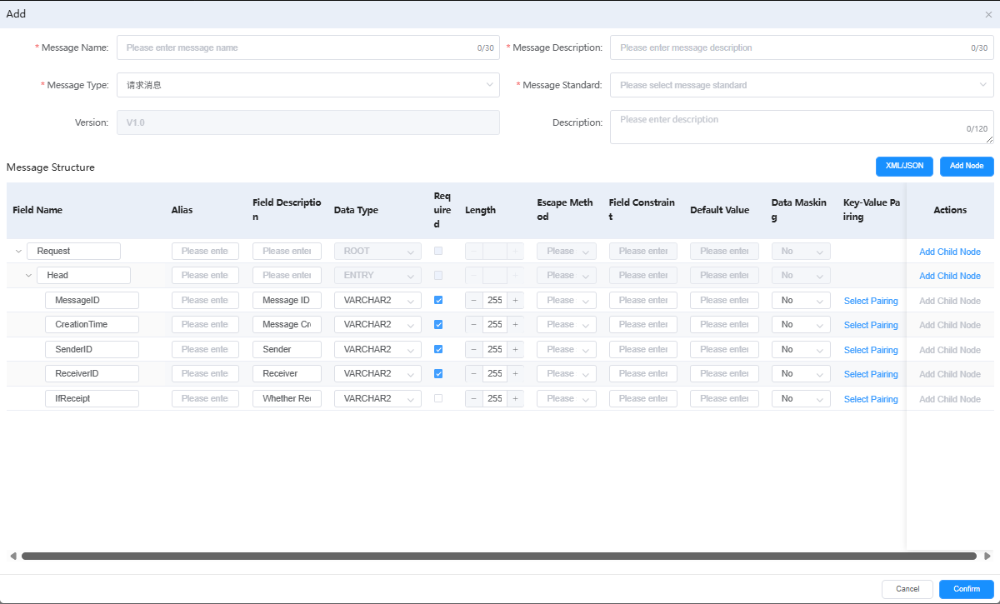

# 消息定义



用于定义系统中各类消息的格式、内容和传输规范，确保数据交换的标准化。

## 功能说明

### 消息查询筛选
- **Message Name**: 消息名称筛选，支持"All"选项查看所有消息
- **Message Type**: 消息类型筛选，支持"All"选项查看所有类型
- **Message Standard**: 消息标准筛选，支持"All"选项查看所有标准
- **Search/Reset**: 提供搜索和重置功能按钮

### 消息操作按钮
- **Add**: 新增消息定义
- **Sync**: 同步消息配置

### 消息新增功能


点击"Add"按钮后弹出消息新增对话框，支持完整的消息结构定义：

#### 基本信息配置
- **Message Name**: 消息名称输入（最多30个字符）
- **Message Description**: 消息描述输入（最多30个字符）
- **Message Type**: 消息类型选择（如：请求通信）
- **Message Standard**: 消息标准选择
- **Version**: 版本号设置（默认V1.0）
- **Description**: 详细描述输入（最多120个字符）

#### 消息结构设计 (Message Structure)
提供树形结构的消息字段定义：

**字段定义表格包含以下列**：
- **Field Name**: 字段名称
- **Alias**: 字段别名
- **Field Description**: 字段描述
- **Data Type**: 数据类型（如ROOT、ENTRY、VARCHAR2等）
- **Required**: 是否必填（勾选框）
- **Length**: 字段长度（如255）
- **Escape Method**: 转义方法
- **Field Constraint**: 字段约束
- **Default Value**: 默认值
- **Data Masking**: 数据脱敏设置
- **Key-Value Pairing**: 键值配对
- **Actions**: 操作按钮（Add Child Node）

**示例消息结构**：
```
Request (ROOT)
├── Head (ENTRY)
│   ├── MessageID (VARCHAR2, 255, Required)
│   ├── CreationTime (VARCHAR2, 255, Required) 
│   ├── SenderID (VARCHAR2, 255, Required)
│   ├── ReceiverID (VARCHAR2, 255, Required)
│   └── IfReceipt (VARCHAR2, 255, Optional)
```

#### 功能操作按钮
- **XML/JSON**: 在XML和JSON格式间切换
- **Add Node**: 添加新的字段节点
- **Add Child Node**: 为现有节点添加子节点
- **Select Pairing**: 选择字段配对
- **Cancel**: 取消操作
- **Confirm**: 确认保存

### 消息管理操作
每条消息记录支持以下操作：
- **Sync**: 同步消息定义到系统
- **Edit**: 编辑消息定义内容
- **Copy**: 复制消息定义创建新消息
- **Details**: 查看消息详细信息

## 消息分类说明

### 消息类型 (Message Type)
- **Request**: 请求消息，用于发起服务调用
- **Response**: 响应消息，用于返回服务结果

### 消息标准 (Message Standard)
- **JSON&XML**: 支持JSON和XML两种数据格式，同时可以通过XML/JSON直接导入数据结构

### 类名规范 (Class Name)
- 遵循 `CSIP.Action.[MessageName].[Type]` 的命名规范
- 例如：`CSIP.Action.DischargeInfoAdd.Request`

## 数据类型说明
- **ROOT**: 根节点类型
- **ENTRY**: 条目节点类型
- **VARCHAR2**: 可变长度字符串类型
- **字段长度**: 支持自定义字段长度（如255字符）
- **必填标识**: 通过勾选框控制字段是否必填

## 关键功能价值
- **标准化管理**: 统一管理所有消息定义，确保数据交换规范
- **版本控制**: 支持消息版本管理，便于系统升级维护
- **多格式支持**: 同时支持JSON和XML格式
- **操作便捷**: 提供完整的增删改查功能
- **实时同步**: 支持消息定义的实时同步更新
- **结构化设计**: 通过树形结构直观展示消息层次关系
- **灵活配置**: 支持字段约束(正则表达式)、数据脱敏、键值配对(key-value:fieldcode=01,fieldvalue=man,验证值域是否正确)等高级配置

---

# Message Definition


Used to define the format, content, and transmission specifications of various messages in the system, ensuring standardized data exchange.

## Feature Description

### Message Query and Filtering
- **Message Name**: Message name filtering with "All" option to view all messages
- **Message Type**: Message type filtering with "All" option to view all types
- **Message Standard**: Message standard filtering with "All" option to view all standards
- **Search/Reset**: Provides search and reset function buttons

### Message Operation Buttons
- **Add**: Add new message definition
- **Sync**: Synchronize message configuration

### Message Addition Feature


Clicking the "Add" button opens a message addition dialog that supports complete message structure definition:

#### Basic Information Configuration
- **Message Name**: Message name input (max 30 characters)
- **Message Description**: Message description input (max 30 characters)
- **Message Type**: Message type selection (e.g., Request Communication)
- **Message Standard**: Message standard selection
- **Version**: Version number setting (default V1.0)
- **Description**: Detailed description input (max 120 characters)

#### Message Structure Design
Provides tree-structured message field definition:

**Field Definition Table includes the following columns**:
- **Field Name**: Field name
- **Alias**: Field alias
- **Field Description**: Field description
- **Data Type**: Data type (e.g., ROOT, ENTRY, VARCHAR2)
- **Required**: Whether required (checkbox)
- **Length**: Field length (e.g., 255)
- **Escape Method**: Escape method
- **Field Constraint**: Field constraint
- **Default Value**: Default value
- **Data Masking**: Data masking settings
- **Key-Value Pairing**: Key-value pairing
- **Actions**: Action buttons (Add Child Node)

**Example Message Structure**:
```
Request (ROOT)
├── Head (ENTRY)
│   ├── MessageID (VARCHAR2, 255, Required)
│   ├── CreationTime (VARCHAR2, 255, Required) 
│   ├── SenderID (VARCHAR2, 255, Required)
│   ├── ReceiverID (VARCHAR2, 255, Required)
│   └── IfReceipt (VARCHAR2, 255, Optional)
```

#### Function Operation Buttons
- **XML/JSON**: Switch between XML and JSON formats
- **Add Node**: Add new field node
- **Add Child Node**: Add child node to existing node
- **Select Pairing**: Select field pairing
- **Cancel**: Cancel operation
- **Confirm**: Confirm and save

### Message Management Operations
Each message record supports the following operations:
- **Sync**: Synchronize message definition to system
- **Edit**: Edit message definition content
- **Copy**: Copy message definition to create new message
- **Details**: View detailed message information

## Message Classification Description

### Message Types
- **Request**: Request message for initiating service calls
- **Response**: Response message for returning service results

### Message Standards
- **JSON&XML**: Supports both JSON and XML data formats, with direct data structure import through XML/JSON

### Class Name Convention
- Follows `CSIP.Action.[MessageName].[Type]` naming convention
- Example: `CSIP.Action.DischargeInfoAdd.Request`

## Data Type Description
- **ROOT**: Root node type
- **ENTRY**: Entry node type
- **VARCHAR2**: Variable-length string type
- **Field Length**: Supports custom field length (e.g., 255 characters)
- **Required Flag**: Controls whether field is required through checkbox

## Key Functional Value
- **Standardized Management**: Unified management of all message definitions ensuring data exchange standards
- **Version Control**: Supports message version management for system upgrade and maintenance
- **Multi-format Support**: Simultaneous support for JSON and XML formats
- **Operation Convenience**: Provides complete CRUD functionality
- **Real-time Sync**: Supports real-time synchronization and updates of message definitions
- **Structured Design**: Intuitive display of message hierarchy through tree structure
- **Flexible Configuration**: Supports advanced configurations such as field constraints (regular expressions), data masking, key-value pairing (key-value: fieldcode=01, fieldvalue=man, validate value domain correctness)