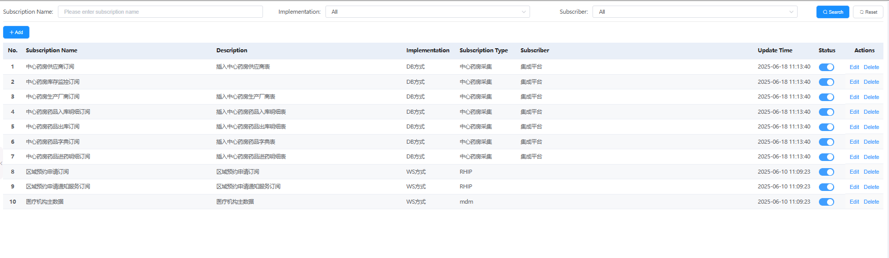
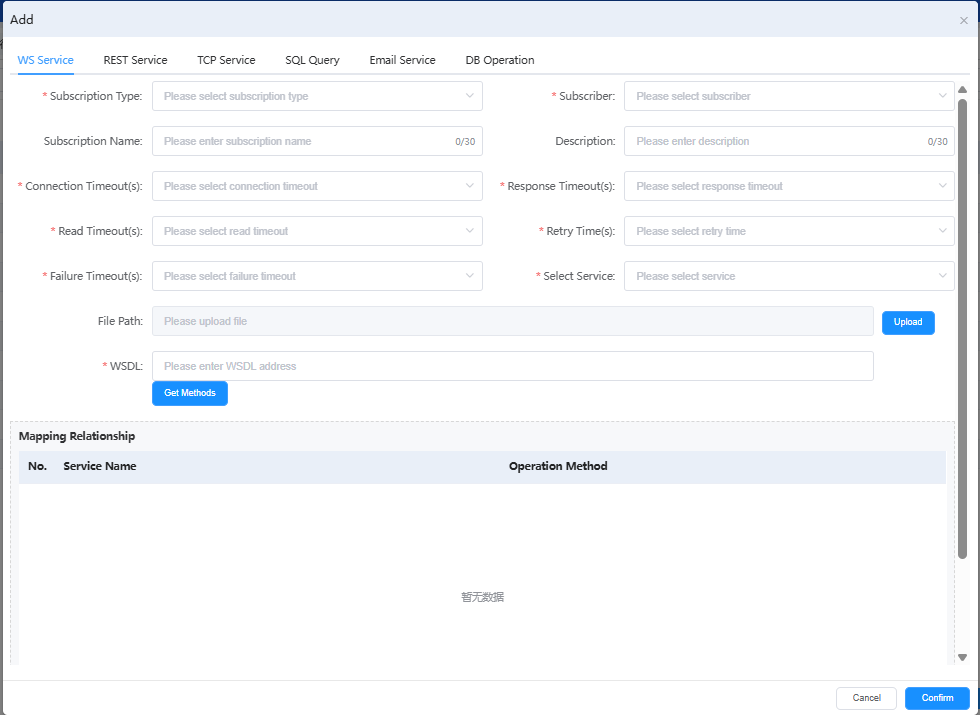

# 操作管理

用于管理用户在系统中的各类操作权限和操作记录。

## 功能说明

### 订阅查询筛选
- **Subscription Name**: 订阅名称筛选，支持输入订阅名称进行模糊查询
- **Implementation**: 实现方式筛选，支持"All"选项查看所有实现方式
- **Subscriber**: 订阅者筛选，支持"All"选项查看所有订阅者
- **Search/Reset**: 提供搜索和重置功能按钮

### 订阅操作按钮
- **Add**: 新增订阅配置

### 订阅新增功能

点击"Add"按钮后弹出订阅新增对话框，支持多种服务类型的订阅配置：

#### 服务类型选择
系统支持以下六种服务类型的订阅配置：
- **WS Service**: Web Service服务订阅
- **REST Service**: REST服务订阅
- **TCP Service**: TCP服务订阅
- **SQL Query**: SQL查询订阅，多表联合查询，支持一对多关系，多层嵌套
- **Email Service**: 邮件服务订阅
- **DB Operation**: 数据库操作订阅

#### 基本信息配置
- **Subscription Type**: 订阅类型选择（下拉选择）
- **Subscriber**: 订阅者选择（下拉选择）
- **Subscription Name**: 订阅名称输入（最多30个字符）
- **Description**: 订阅描述输入（最多30个字符）

#### 超时配置参数
- **Connection Timeout(s)**: 连接超时时间设置（秒）
- **Response Timeout(s)**: 响应超时时间设置（秒）
- **Read Timeout(s)**: 读取超时时间设置（秒）
- **Retry Time(s)**: 重试时间设置（秒）
- **Failure Timeout(s)**: 失败超时时间设置（秒）
- **Select Service**: 服务选择（下拉选择关联的服务）

#### Web Service配置（WS Service选中时）
- **File Path**: 文件路径配置
  - 支持文件上传功能（Upload按钮）
- **WSDL**: Web Service描述语言地址
  - 输入WSDL地址
  - **Get Methods**: 获取可用方法按钮

#### 映射关系配置 (Mapping Relationship)
提供服务映射关系的配置表格：
- **No.**: 序号
- **Service Name**: 服务名称
- **Operation Method**: 操作方法

配置表格下方显示"暂无数据"，表示当前未配置映射关系。

#### 配置字段说明
- **必填字段标识**: 带红色星号(*)的字段为必填项
- **字符限制**: 
  - Subscription Name: 0/30字符
  - Description: 0/30字符
- **下拉选择**: Subscription Type、Subscriber、Select Service均为下拉选择
- **超时参数**: 所有超时参数都支持下拉选择预设值

#### 操作按钮
- **Cancel**: 取消订阅新增操作
- **Confirm**: 确认保存订阅配置

### 订阅配置流程
1. **服务类型选择**: 选择WS Service、REST Service、TCP Service等服务类型
2. **基本信息填写**: 完成订阅类型、订阅者、名称、描述等信息
3. **超时参数设置**: 配置各种超时时间参数
4. **服务配置**: 根据选择的服务类型进行特定配置
   - WS Service: 配置文件路径和WSDL地址
   - 其他服务类型: 相应的特定配置
5. **映射关系配置**: 设置服务与操作方法的映射关系
6. **确认保存**: 验证所有必填项后保存配置

### 订阅分类说明

#### 实现方式 (Implementation)
- **DB方式**: 数据库方式实现的订阅
- **WS方式**: Web Service方式实现的订阅

#### 订阅类型 (Subscription Type)
- **中心药房类型**: 中心药房相关的订阅类型
- **RHIP**: 区域健康信息平台订阅类型
- **mdm**: 主数据管理订阅类型

#### 订阅者 (Subscriber)
- **集成平台**: 系统集成平台作为订阅者
- **-**: 未指定特定订阅者

#### 订阅状态管理
- **状态**: 通过开关按钮控制订阅的启用/禁用状态
- **实时切换**: 支持在线实时切换订阅状态

### 订阅管理操作
每个订阅支持以下管理操作：
- **Edit**: 编辑订阅配置信息
- **Delete**: 删除订阅配置

### 订阅业务分类

#### 中心药房订阅 (1-7)
- 涵盖药房配药、住院、出厂、病人信息、出料、支持等各个环节
- 统一使用DB方式实现
- 订阅者为集成平台
- 支持药房业务全流程数据订阅

#### 区域医疗订阅 (8-9)
- 区域医院出院相关订阅
- 使用WS方式实现
- RHIP类型订阅
- 支持区域医疗信息共享

#### 主数据管理订阅 (10)
- 医疗机构注册信息订阅
- 使用WS方式实现
- mdm类型订阅
- 支持主数据同步

## 关键功能价值
- **统一订阅管理**: 集中管理所有系统订阅配置和状态
- **多种实现方式**: 支持DB方式和WS方式的订阅实现
- **业务分类清晰**: 按照业务类型进行订阅分类管理
- **实时状态控制**: 支持订阅状态的实时启用/禁用
- **灵活配置**: 支持订阅的编辑和删除操作
- **数据同步**: 确保各业务系统间的数据一致性
- **多服务类型支持**: 支持WS、REST、TCP、SQL、Email、DB等多种服务类型
- **完善的超时机制**: 提供全面的超时参数配置，确保服务稳定性
- **可视化配置**: 通过友好的界面进行订阅配置和映射关系管理

---

# Operation Management

Used to manage various user operation permissions and operation records in the system.

## Feature Description

### Subscription Query and Filtering
- **Subscription Name**: Subscription name filtering with fuzzy search by subscription name input
- **Implementation**: Implementation method filtering with "All" option to view all implementation methods
- **Subscriber**: Subscriber filtering with "All" option to view all subscribers
- **Search/Reset**: Provides search and reset function buttons

### Subscription Operation Buttons
- **Add**: Add new subscription configuration

### Subscription Addition Feature

Clicking the "Add" button opens a subscription addition dialog that supports multiple service type subscription configurations:

#### Service Type Selection
The system supports subscription configuration for the following six service types:
- **WS Service**: Web Service subscription
- **REST Service**: REST service subscription
- **TCP Service**: TCP service subscription
- **SQL Query**: SQL query subscription, supports multi-table joins, one-to-many relationships, and nested queries
- **Email Service**: Email service subscription
- **DB Operation**: Database operation subscription

#### Basic Information Configuration
- **Subscription Type**: Subscription type selection (dropdown selection)
- **Subscriber**: Subscriber selection (dropdown selection)
- **Subscription Name**: Subscription name input (max 30 characters)
- **Description**: Subscription description input (max 30 characters)

#### Timeout Configuration Parameters
- **Connection Timeout(s)**: Connection timeout setting (seconds)
- **Response Timeout(s)**: Response timeout setting (seconds)
- **Read Timeout(s)**: Read timeout setting (seconds)
- **Retry Time(s)**: Retry time setting (seconds)
- **Failure Timeout(s)**: Failure timeout setting (seconds)
- **Select Service**: Service selection (dropdown to select associated service)

#### Web Service Configuration (when WS Service is selected)
- **File Path**: File path configuration
  - Supports file upload functionality (Upload button)
- **WSDL**: Web Service Description Language address
  - Input WSDL address
  - **Get Methods**: Get available methods button

#### Mapping Relationship Configuration
Provides service mapping relationship configuration table:
- **No.**: Serial number
- **Service Name**: Service name
- **Operation Method**: Operation method

The configuration table shows "No data available" below, indicating no mapping relationships are currently configured.

#### Configuration Field Description
- **Required Field Indicator**: Fields with red asterisk (*) are required
- **Character Limits**:
  - Subscription Name: 0/30 characters
  - Description: 0/30 characters
- **Dropdown Selections**: Subscription Type, Subscriber, Select Service are all dropdown selections
- **Timeout Parameters**: All timeout parameters support dropdown selection of preset values

#### Operation Buttons
- **Cancel**: Cancel subscription addition operation
- **Confirm**: Confirm and save subscription configuration

### Subscription Configuration Process
1. **Service Type Selection**: Choose WS Service, REST Service, TCP Service, etc.
2. **Basic Information**: Complete subscription type, subscriber, name, description, etc.
3. **Timeout Parameter Settings**: Configure various timeout parameters
4. **Service Configuration**: Specific configuration based on selected service type
   - WS Service: Configure file path and WSDL address
   - Other service types: Corresponding specific configurations
5. **Mapping Relationship Configuration**: Set mapping relationships between services and operation methods
6. **Confirm and Save**: Validate all required fields and save configuration

### Subscription Classification Description

#### Implementation Methods
- **DB Method**: Database-based subscription implementation
- **WS Method**: Web Service-based subscription implementation

#### Subscription Types
- **Central Pharmacy Type**: Central pharmacy-related subscription type
- **RHIP**: Regional Health Information Platform subscription type
- **mdm**: Master data management subscription type

#### Subscribers
- **Integration Platform**: System integration platform as subscriber
- **-**: No specific subscriber specified

#### Subscription Status Management
- **Status**: Control subscription enable/disable status through toggle buttons
- **Real-time Switching**: Supports online real-time subscription status switching

### Subscription Management Operations
Each subscription supports the following management operations:
- **Edit**: Edit subscription configuration information
- **Delete**: Delete subscription configuration

### Subscription Business Classification

#### Central Pharmacy Subscriptions (1-7)
- Covers all aspects of pharmacy dispensing, inpatient care, factory output, patient information, material output, and support
- Uniformly implemented using DB method
- Integration platform as subscriber
- Supports full pharmacy business process data subscription

#### Regional Medical Subscriptions (8-9)
- Regional hospital discharge-related subscriptions
- Implemented using WS method
- RHIP type subscriptions
- Supports regional medical information sharing

#### Master Data Management Subscriptions (10)
- Medical institution registration information subscription
- Implemented using WS method
- mdm type subscription
- Supports master data synchronization

## Key Functional Value
- **Unified Subscription Management**: Centralized management of all system subscription configurations and statuses
- **Multiple Implementation Methods**: Supports both DB method and WS method subscription implementations
- **Clear Business Classification**: Subscription classification management by business type
- **Real-time Status Control**: Supports real-time subscription enable/disable
- **Flexible Configuration**: Supports subscription editing and deletion operations
- **Data Synchronization**: Ensures data consistency across business systems
- **Multiple Service Type Support**: Supports WS, REST, TCP, SQL, Email, DB and other service types
- **Comprehensive Timeout Mechanism**: Provides comprehensive timeout parameter configuration to ensure service stability
- **Visual Configuration**: Subscription configuration and mapping relationship management through user-friendly interface 