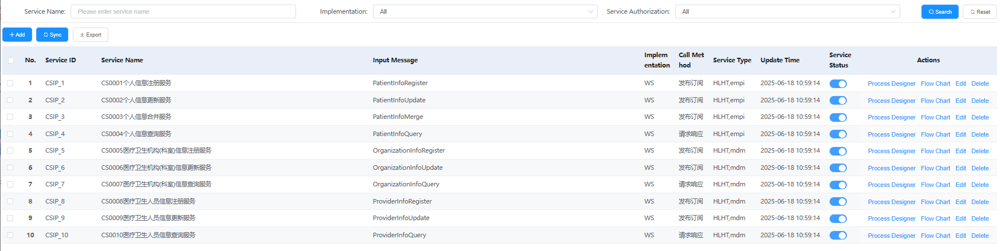
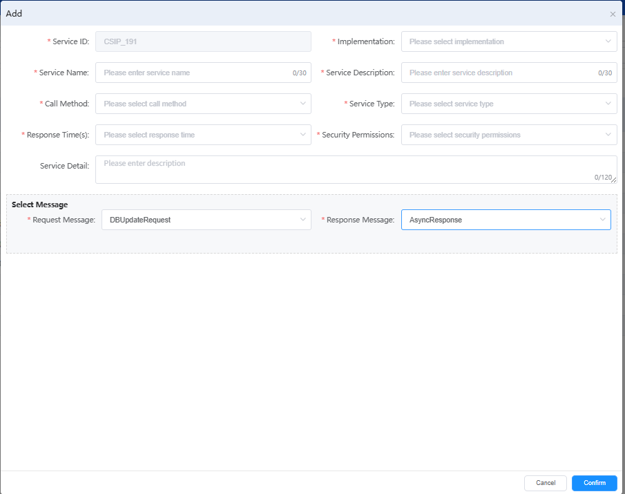

# 服务管理

对系统内所有服务进行统一管理，包括服务的同步、注册、配置、启停，流程设计，服务流程图等操作。

## 功能说明

### 服务查询筛选
- **Service Name**: 服务名称筛选，支持输入服务名称进行模糊查询
- **Implementation**: 实现方式筛选，支持"All"选项查看所有实现方式
- **Service Authorization**: 服务授权筛选，支持"All"选项查看所有授权状态
- **Search/Reset**: 提供搜索和重置功能按钮

### 服务操作按钮
- **Add**: 新增服务配置
- **Sync**: 同步服务配置
- **Export**: 导出服务配置

### 服务新增功能

点击"Add"按钮后弹出服务新增对话框，支持完整的服务配置：

#### 基本信息配置
- **Service ID**: 服务唯一标识（如：CSIP_101）
- **Implementation**: 实现方式选择（需要从下拉列表中选择）
- **Service Name**: 服务名称输入（最多30个字符）
- **Service Description**: 服务描述输入（最多30个字符）
- **Call Method**: 调用方法选择（下拉选择）
- **Service Type**: 服务类型选择（下拉选择）
- **Response Time(s)**: 响应时间设置（选择响应时间范围）
- **Security Permissions**: 安全权限设置（选择安全权限级别）
- **Service Detail**: 服务详细说明（最多120个字符的文本框描述）

#### 消息配置 (Select Message)
**请求响应消息配置**：
- **Request Message**: 请求消息选择
  - 默认值示例：DBUpdateRequest
  - 支持下拉选择已定义的请求消息
- **Response Message**: 响应消息选择
  - 默认值示例：AsyncResponse
  - 支持下拉选择已定义的响应消息

#### 配置字段说明
- **必填字段标识**: 带红色星号(*)的字段为必填项
- **字符限制**: 
  - Service Name: 0/30字符
  - Service Description: 0/30字符
  - Service Detail: 0/120字符
- **下拉选择**: Implementation、Call Method、Service Type、Response Time、Security Permissions均为下拉选择
- **消息关联**: 请求消息和响应消息通过下拉框关联已定义的消息类型

#### 操作按钮
- **Cancel**: 取消服务新增操作
- **Confirm**: 确认保存服务配置

### 服务配置流程
1. **基本信息填写**: 完成服务ID、名称、描述等基础信息
2. **技术参数选择**: 选择实现方式、调用方法、服务类型
3. **性能参数设置**: 配置响应时间和安全权限
4. **消息绑定**: 关联请求消息和响应消息
5. **详细描述**: 补充服务的详细说明信息
6. **确认保存**: 验证所有必填项后保存配置

### 服务列表展示
以表格形式展示系统中所有已配置的服务：

| 序号 | 服务ID | 服务名称 | 输入消息 | 实现方式 | 调用方法 | 服务类型 | 更新时间 | 服务状态 | 操作 |
|------|--------|----------|----------|----------|----------|----------|----------|----------|------|
| 1 | CSIP_1 | CS0001个人信息注册服务 | PatientInfoRegister | WS | 发布调用 | HL7Ltmpl | 2025-06-18 10:59:14 | 启用 | Process Designer/Flow Chart |
| 2 | CSIP_2 | CS0002个人信息更新服务 | PatientInfoUpdate | WS | 发布调用 | HL7Ltmpl | 2025-06-18 10:59:14 | 启用 | Process Designer/Flow Chart |
| 3 | CSIP_3 | CS0003个人信息合并服务 | PatientInfoMerge | WS | 发布调用 | HL7Ltmpl | 2025-06-18 10:59:14 | 启用 | Process Designer/Flow Chart |
| 4 | CSIP_4 | CS0004个人信息查询服务 | PatientInfoQuery | WS | 请求应答 | HL7Ltmpl | 2025-06-18 10:59:14 | 启用 | Process Designer/Flow Chart |
| 5 | CSIP_5 | CS0005医疗卫生机构执业信息注册服务 | OrganizationInfoRegister | WS | 发布调用 | HL7Lmdm | 2025-06-18 10:59:14 | 启用 | Process Designer/Flow Chart |
| 6 | CSIP_6 | CS0006医疗卫生机构执业信息更新服务 | OrganizationInfoUpdate | WS | 发布调用 | HL7Lmdm | 2025-06-18 10:59:14 | 启用 | Process Designer/Flow Chart |
| 7 | CSIP_7 | CS0007医疗卫生机构执业信息查询服务 | OrganizationInfoQuery | WS | 请求应答 | HL7Lmdm | 2025-06-18 10:59:14 | 启用 | Process Designer/Flow Chart |
| 8 | CSIP_8 | CS0008医疗卫生人员信息注册服务 | ProviderInfoRegister | WS | 发布调用 | HL7Lmdm | 2025-06-18 10:59:14 | 启用 | Process Designer/Flow Chart |
| 9 | CSIP_9 | CS0009医疗卫生人员信息更新服务 | ProviderInfoUpdate | WS | 发布调用 | HL7Lmdm | 2025-06-18 10:59:14 | 启用 | Process Designer/Flow Chart |
| 10 | CSIP_10 | CS0010医疗卫生人员信息查询服务 | ProviderInfoQuery | WS | 请求应答 | HL7Lmdm | 2025-06-18 10:59:14 | 启用 | Process Designer/Flow Chart |

### 服务分类说明

#### 实现方式 (Implementation)
- **WS**: Web Service实现方式
- **REST**: REST Service实现方式
- **TCP**: TCP Service实现方式
- **SQL**: SQL Service实现方式

#### 调用方法 (Call Method)
- **发布调用**: 发布订阅模式的服务调用
- **请求应答**: 请求响应模式的服务调用

#### 服务类型 (Service Type)
- **HL7Ltmpl**: HL7模板类型服务
- **HL7Lmdm**: HL7主数据管理类型服务

#### 服务状态管理
- **服务状态**: 通过开关按钮控制服务的启用/禁用状态
- **实时切换**: 支持在线实时切换服务状态

### 服务管理操作
每个服务支持以下管理操作：
- **Process Designer**: 进程设计器，用于设计服务处理流程
- **Flow Chart**: 流程图查看，可视化服务流程

### 服务业务分类

#### 个人信息服务 (CS0001-CS0004)
- 个人信息注册、更新、合并、查询
- 使用PatientInfo系列消息
- 支持HL7Ltmpl模板

#### 机构信息服务 (CS0005-CS0007)
- 医疗卫生机构执业信息的注册、更新、查询
- 使用OrganizationInfo系列消息
- 支持HL7Lmdm主数据管理

#### 人员信息服务 (CS0008-CS0010)
- 医疗卫生人员信息的注册、更新、查询
- 使用ProviderInfo系列消息
- 支持HL7Lmdm主数据管理

## 关键功能价值
- **统一管理**: 集中管理所有服务的配置和状态
- **标准化服务**: 基于HL7标准的医疗信息交换服务
- **灵活调用**: 支持多种调用模式（发布调用、请求应答）
- **可视化设计**: 通过流程设计器和流程图支持服务可视化
- **实时控制**: 支持服务状态的实时启用/禁用
- **批量操作**: 支持服务配置的批量同步和导出
- **消息集成**: 与消息定义模块无缝集成，支持消息选择和绑定
- **安全管控**: 提供安全权限配置，确保服务访问安全

---

# Service Management

Unified management of all services in the system, including service synchronization, registration, configuration, start/stop, process design(Healthconnect BP), service flow charts, and other operations.

## Feature Description

### Service Query and Filtering
- **Service Name**: Service name filtering with fuzzy search by service name input
- **Implementation**: Implementation method filtering with "All" option to view all implementation methods
- **Service Authorization**: Service authorization filtering with "All" option to view all authorization statuses
- **Search/Reset**: Provides search and reset function buttons

### Service Operation Buttons
- **Add**: Add new service configuration
- **Sync**: Synchronize service configuration
- **Export**: Export service configuration

### Service Addition Feature

Clicking the "Add" button opens a service addition dialog that supports complete service configuration:

#### Basic Information Configuration
- **Service ID**: Unique service identifier (e.g., CSIP_101)
- **Implementation**: Implementation method selection (dropdown selection required)
- **Service Name**: Service name input (max 30 characters)
- **Service Description**: Service description input (max 30 characters)
- **Call Method**: Call method selection (dropdown selection)
- **Service Type**: Service type selection (dropdown selection)
- **Response Time(s)**: Response time setting (select response time range)
- **Security Permissions**: Security permission setting (select security permission level)
- **Service Detail**: Detailed service description (max 120 characters text box)

#### Message Configuration (Select Message)
**Request-Response Message Configuration**:
- **Request Message**: Request message selection
  - Default example: DBUpdateRequest
  - Supports dropdown selection of defined request messages
- **Response Message**: Response message selection
  - Default example: AsyncResponse
  - Supports dropdown selection of defined response messages

#### Configuration Field Description
- **Required Field Indicator**: Fields with red asterisk (*) are required
- **Character Limits**:
  - Service Name: 0/30 characters
  - Service Description: 0/30 characters
  - Service Detail: 0/120 characters
- **Dropdown Selections**: Implementation, Call Method, Service Type, Response Time, Security Permissions are all dropdown selections
- **Message Association**: Request and response messages are associated with defined message types through dropdown boxes

#### Operation Buttons
- **Cancel**: Cancel service addition operation
- **Confirm**: Confirm and save service configuration

### Service Configuration Process
1. **Basic Information**: Complete service ID, name, description, and other basic information
2. **Technical Parameter Selection**: Choose implementation method, call method, service type
3. **Performance Parameter Settings**: Configure response time and security permissions
4. **Message Binding**: Associate request message and response message
5. **Detailed Description**: Add detailed service description information
6. **Confirm and Save**: Validate all required fields and save configuration

### Service List Display
Displays all configured services in the system in table format:

| No. | Service ID | Service Name | Input Message | Implementation | Call Method | Service Type | Update Time | Service Status | Actions |
|-----|------------|--------------|---------------|----------------|-------------|--------------|-------------|----------------|---------|
| 1 | CSIP_1 | CS0001 Personal Information Registration Service | PatientInfoRegister | WS | Publish Call | HL7Ltmpl | 2025-06-18 10:59:14 | Enabled | Process Designer/Flow Chart |
| 2 | CSIP_2 | CS0002 Personal Information Update Service | PatientInfoUpdate | WS | Publish Call | HL7Ltmpl | 2025-06-18 10:59:14 | Enabled | Process Designer/Flow Chart |
| 3 | CSIP_3 | CS0003 Personal Information Merge Service | PatientInfoMerge | WS | Publish Call | HL7Ltmpl | 2025-06-18 10:59:14 | Enabled | Process Designer/Flow Chart |
| 4 | CSIP_4 | CS0004 Personal Information Query Service | PatientInfoQuery | WS | Request Response | HL7Ltmpl | 2025-06-18 10:59:14 | Enabled | Process Designer/Flow Chart |
| 5 | CSIP_5 | CS0005 Medical Institution Practice Info Registration | OrganizationInfoRegister | WS | Publish Call | HL7Lmdm | 2025-06-18 10:59:14 | Enabled | Process Designer/Flow Chart |
| 6 | CSIP_6 | CS0006 Medical Institution Practice Info Update | OrganizationInfoUpdate | WS | Publish Call | HL7Lmdm | 2025-06-18 10:59:14 | Enabled | Process Designer/Flow Chart |
| 7 | CSIP_7 | CS0007 Medical Institution Practice Info Query | OrganizationInfoQuery | WS | Request Response | HL7Lmdm | 2025-06-18 10:59:14 | Enabled | Process Designer/Flow Chart |
| 8 | CSIP_8 | CS0008 Healthcare Personnel Info Registration | ProviderInfoRegister | WS | Publish Call | HL7Lmdm | 2025-06-18 10:59:14 | Enabled | Process Designer/Flow Chart |
| 9 | CSIP_9 | CS0009 Healthcare Personnel Info Update | ProviderInfoUpdate | WS | Publish Call | HL7Lmdm | 2025-06-18 10:59:14 | Enabled | Process Designer/Flow Chart |
| 10 | CSIP_10 | CS0010 Healthcare Personnel Info Query | ProviderInfoQuery | WS | Request Response | HL7Lmdm | 2025-06-18 10:59:14 | Enabled | Process Designer/Flow Chart |

### Service Classification Description

#### Implementation Methods
- **WS**: Web Service implementation
- **REST**: REST Service implementation
- **TCP**: TCP Service implementation
- **SQL**: SQL Service implementation

#### Call Methods
- **Publish Call**: Publish-subscribe pattern service invocation
- **Request Response**: Request-response pattern service invocation

#### Service Types
- **HL7Ltmpl**: HL7 template type service
- **HL7Lmdm**: HL7 master data management type service

#### Service Status Management
- **Service Status**: Control service enable/disable status through toggle buttons
- **Real-time Switching**: Supports online real-time service status switching

### Service Management Operations
Each service supports the following management operations:
- **Process Designer**: Process designer for designing service processing workflows
- **Flow Chart**: Flow chart view for visualizing service processes

### Service Business Classification

#### Personal Information Services (CS0001-CS0004)
- Personal information registration, update, merge, and query
- Uses PatientInfo series messages
- Supports HL7Ltmpl templates

#### Institution Information Services (CS0005-CS0007)
- Medical institution practice information registration, update, and query
- Uses OrganizationInfo series messages
- Supports HL7Lmdm master data management

#### Personnel Information Services (CS0008-CS0010)
- Healthcare personnel information registration, update, and query
- Uses ProviderInfo series messages
- Supports HL7Lmdm master data management

## Key Functional Value
- **Unified Management**: Centralized management of all service configurations and statuses
- **Standardized Services**: HL7 standard-based medical information exchange services
- **Flexible Invocation**: Supports multiple invocation patterns (publish call, request response)
- **Visual Design**: Supports service visualization through process designer and flow charts
- **Real-time Control**: Supports real-time service enable/disable
- **Batch Operations**: Supports batch synchronization and export of service configurations
- **Message Integration**: Seamless integration with message definition module, supporting message selection and binding
- **Security Control**: Provides security permission configuration to ensure secure service access 